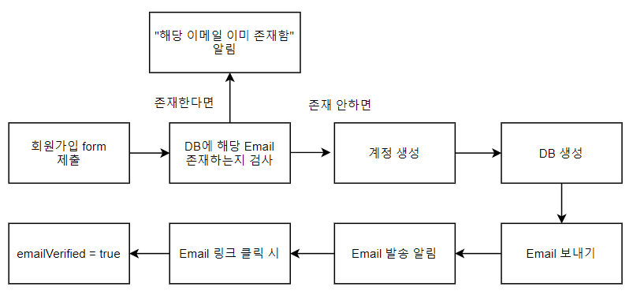

## 로그인 방식을 sns 방식과 로컬방식. 두가지로 구현하고자 한다.

### **OAuth2**(Open Authorization, Open Authentication 2)

- **인증을 위한 표준 프로토콜**
- 구글, 페이스북, 카카오 등에서 제공하는 Authorization Server를 통해 회원 정보를 인증하고 Access Token을 발급받는다.
- 발급받은 Access Token을 이용해 타사의 API 서비스를 이용할 수 있다.

### 로컬방식

- 웹사이트에서 회원가입 폼을 통해 아이디와 비밀번호를 설정하는 것.
- 무분별한 회원가입을 방지하기 위해 이메일 인증 방식을 이용한다.

 

- 해당 과정이 매우 복잡해 보이지만 firebase에서 제공하는 라이브러리를 사용하면 간편하게 이용할 수 있다. (firebase auth)
1. form에서 입력받은 데이터를 DB에 넣어준다.

```jsx
var emailUser = firebase.auth().currentUser;
emailUser.sendEmailVerification().then(function(){
console.log('이메일이 전송됨');
}).catch('email not sent');
```

1. 이 후 currentUser을 받아온 뒤 sendEmailVerification 메소드를 호출한다.
2. 저장된 유저의 email로 인증 메일을 보낸다.
3. 메일 내용을 보면 링크 하나가 온 것을 알 수 있다.
4. 이 링크를 클릭하면 firebase auth 모듈내의 계정 속성 중 하나인 "emailVertified"가 true로 변합니다. (이메일 인증이 완료되었다는 페이지가 호출된 채)

(이메일 발송 내용 및 기타 설정은 firebase 콘솔에서 바꿀 수 있다.)
