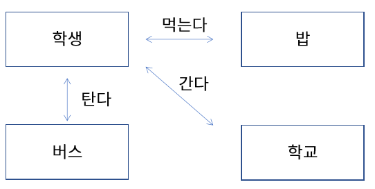
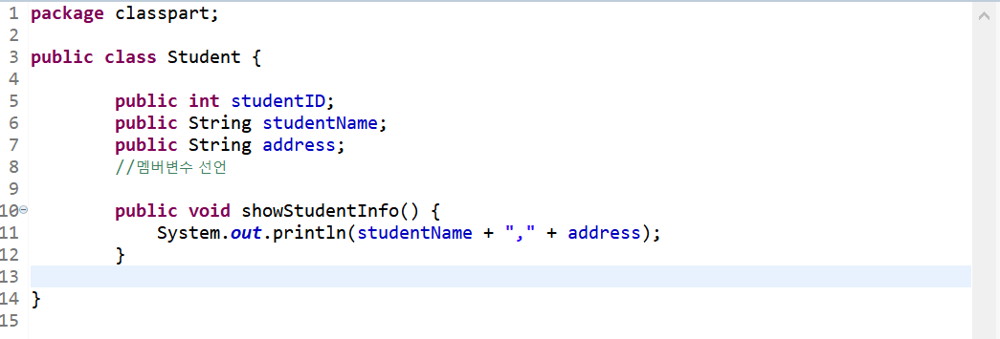
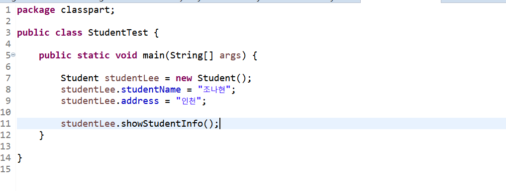
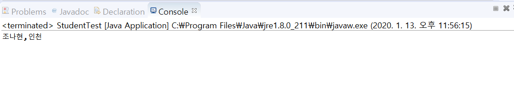

# 01. 객체지향 프로그래밍과 클래스
  
  
#### 객체(Object)  
* 의사나 행위가 미치는 대상 (사전적 의미)  
* 구체적, 추상적 데이터의 단위  
* 예) 사람, 자동차, 주문, 생산, 관리  
  
#### 객체 지향 프로그래밍 (Object Oriented Programming : OOP)  
* 객체를 기반으로 하는 프로그래밍  
* 객체를 정의하고, 객체의 기능을 구현하며, 객체간의 협력(cooperation)을 구현  

#### 절차 지향 프로그래밍 (Procedural Programming)  
* 시간이나 사건의 흐름에 따른 구현  
* 예) C언어  

#### 학교 가는 과정을 구현한 절차 지향 프로그래밍  
일어난다 -> 씻는다 -> 밥을 먹는다 -> 버스를 탄다 -> 요금을 지불한다 -> 학교에 도착한다  
#### 학교 가는 과정을 구현한 객체 지향 프로그래밍  
   
 
#### 클래스 (class)  
* 객체를 코드로 구현한 것  
* 객체 지향 프로그래밍의 가장 기본 요소  
* 객체의 청사진 (blueprint)  

#### 멤버변수   
* 객체가 가지는 속성을 변수로 표현  
* 클래스의 멤버변수  
* member variable, property, attribute 라고 부름  

#### 메소드  
* 객체의 기능을 구현  
* method, member fucntion 라고 부름

#### public 클래스  
자바 파일 하나에 여러 개의 클래스가 존재 할 수도 있다.  
단, public 클래스는 하나이고, public 클래스와 자바 파일 이름이 동일해야 한다.  

## 실습해보기  
#### 학생 클래스 정의하이 멤버변수, 메소드 사용하기  
   
    
     
* 클래스 선언과 클래스 사용 파일(main 메소드) 분리하기 
