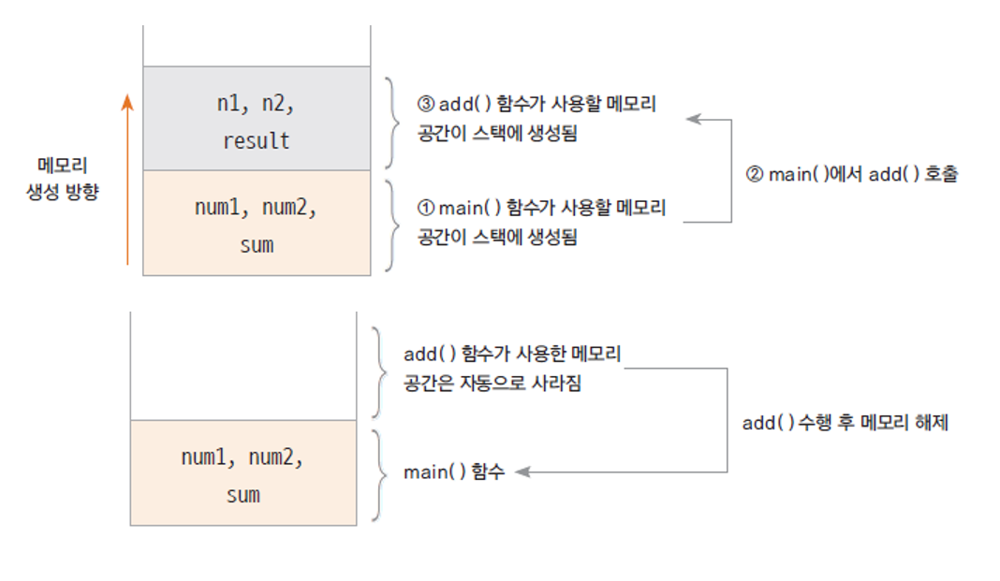

# 02. 함수와 메소드
  
  
#### 험수 (function)
* 하나의 기능을 수행하는 일련의 코드  
* 함수는 호출하여 사용하고 기능이 수행된 후 값을 반환 할 수 있음  
* 함수로 구현된 기능은 여러 곳에서 호출되어 사용될 수 있음    
* 기능 분리 -> 가독성 좋음  
  
#### 함수 정의 하기
* 함수는 이름, 매개변수, 반환 값, 함수 몸체(body)로 구성됨
````
  int add(int num1, int num2) {  
    int result;  
    result = num1 + num2;  
    return result;  
  }
````
  
#### 실습해보기
```
package classpart;

public class FunctionTest {

	// 매개변수, 리턴값 있는 경우
	public static int addNum(int num1, int num2) {
		int result;
		result = num1 + num2;
		return result;
	}
	
	// 매개변수 o 리턴값 X
	public static void sayHello(String greeting) {
		System.out.println(greeting);
	}
	
	// 매개변수 X 리턴값 o
	public static int calcSum() {
		int sum = 0;
		int i;
		
		for (i=0; i<=100; i++) {
			sum += i;
		}
		return sum;
	}
	
	public static void main(String[] args) {
		int n1 = 10;
		int n2 = 20;
		
		int total = addNum(n1, n2);
		sayHello("안녕하세요");
		int num = calcSum();
		
		System.out.println(total);
		System.out.println(num);
		
	}

}
```

#### 함수와 스택 메모리  
##### 스택
: 함수가 호출될 때 사용하는 메모리  
함수가 호출 된 후 수행이 끝나면 자동으로 반환되는 메모리  
##### 함수 호출과 스택 메모리 구조  
01의 실습해보기 코드 참고  
  

#### 메소드 (method)  
* 객체의 기능을 구현하기 위해 클래스 내부에 구현되는 함수  
* 메소드를 구현함으로써 객체의 기능이 구현 됨  
* 메소드의 이름은 사용하는 쪽(클라이언트 코드)에 맞게 명명하는 것이 좋음  
ex) getStudentName() -> camel notation 으로 사용!
