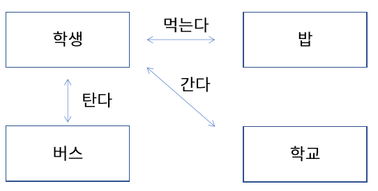

# 02. 함수와 메소드
  
  
#### 험수 (function)
* 하나의 기능을 수행하는 일련의 코드  
* 함수는 호출하여 사용하고 기능이 수행된 후 값을 반환 할 수 있음  
* 함수로 구현된 기능은 여러 곳에서 호출되어 사용될 수 있음    
* 기능 분리 -> 가독성 좋음  
  
#### 함수 정의 하기
* 함수는 이름, 매개변수, 반환 값, 함수 몸체(body)로 구성됨
<code>
  int add(int num1, int num2) {  
    int result;  
    result = num1 + num2;  
    return result;  
  }
  </code>  

   
