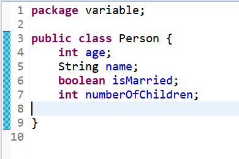
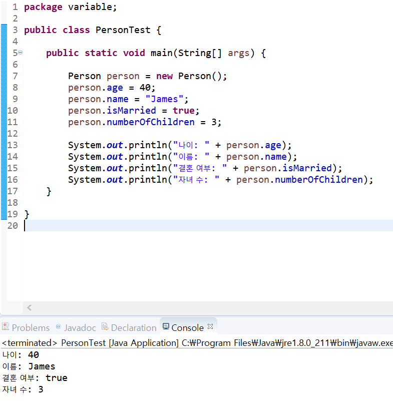
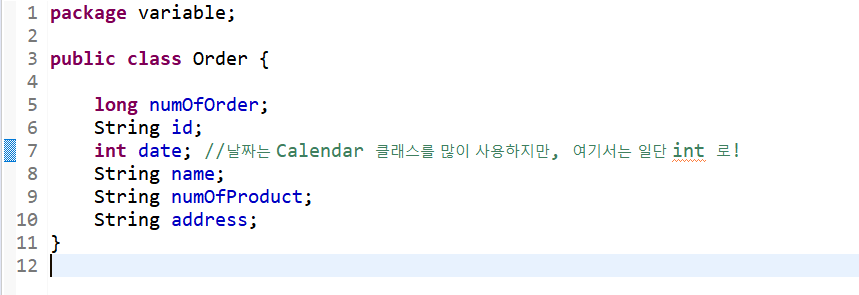
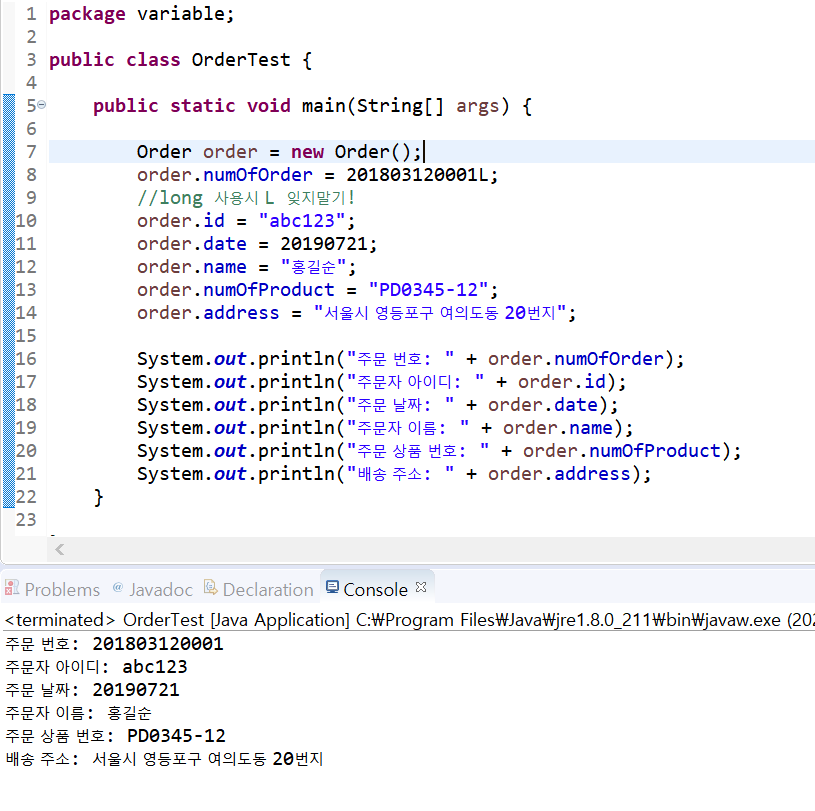

# 04. 코딩해보기
  
  
#### 다음 객체에 대한 설명에 맞는 클래스를 만들고 값을 출력해 보세요.  
> 나이가 40살, 이름이 James 라는 남자가 있다.  
> 이 남자는 결혼을 했고, 자식이 셋 있습니다.  
> <출력 결과>  
> 나이 : 40  
> 이름 : James  
> 결혼여부 : true  
> 자녀 수 : 3  

  
  

#### 아래 내용을 클래스로 구현하세요.  
> 쇼핑몰에 주문이 들어왔습니다. 주문 내용은 다음과 같습니다.  
> 주문 번호 : 201907210001  
> 주문자 아이디 : abc123  
> 주문 날짜 : 20190721  
> 주문자 이름 : 홍길순  
> 주문 상품 번호 : PD0345-12  
> 배송 주소 : 서울시 영등포구 여의도동 20번지  

  
  
