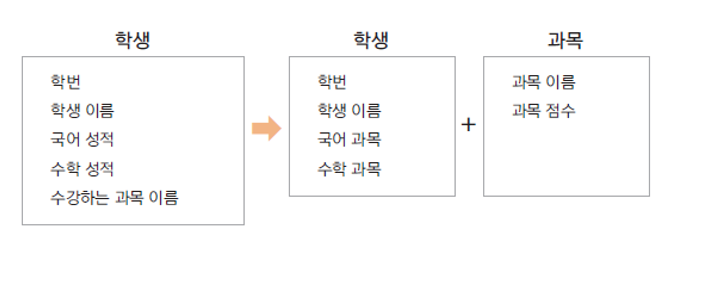
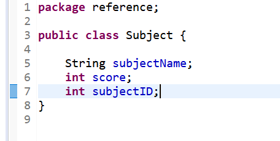
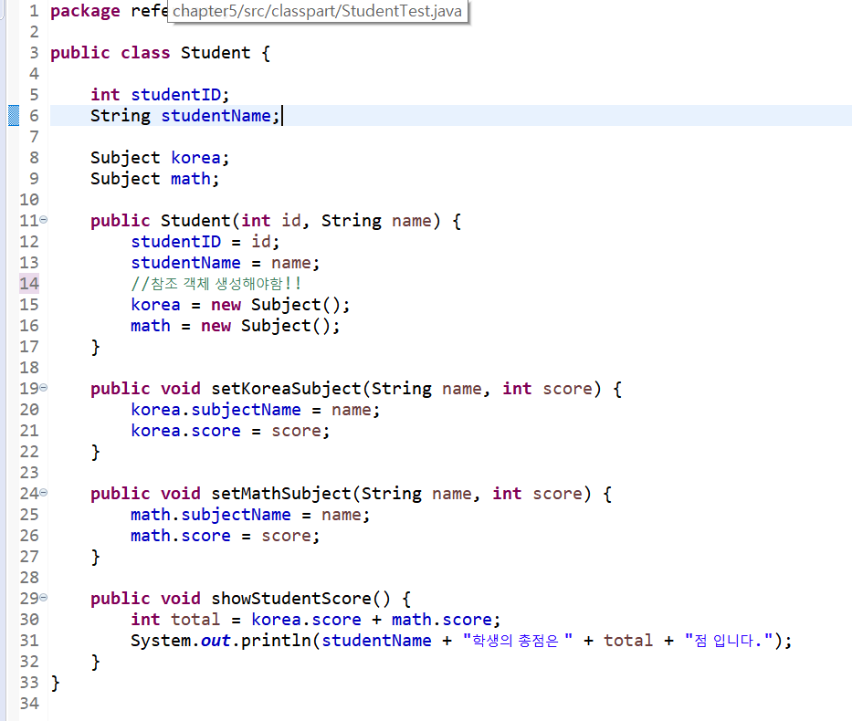
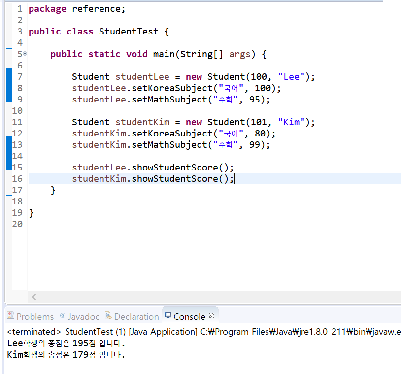

# 06. 참조 자료형 (reference data type)
    
#### 변수의 자료형   
* 기본 자료형 int, long, float, double 등  
* 참조 자료형 String, Date, Student 등  
* 클래스형으로 변수를 선언함  
```
String name;
```  
* 기본 자료형은 사용하는 메모리가 정해져 있지만, 참조 자료형은 클래스에 따라 다름  
 
#### 참조 자료형 직접 만들어 사용하기  
학생 클래스(Student)에 있는 과목 이름, 과목 성적 속성을 과목 클래스(Subject)로 분리하고  
Subject 참조 자료형 멤버변수를 Student에 정의하여 사용함  
 

#### 실습해보기  
 
 
 
