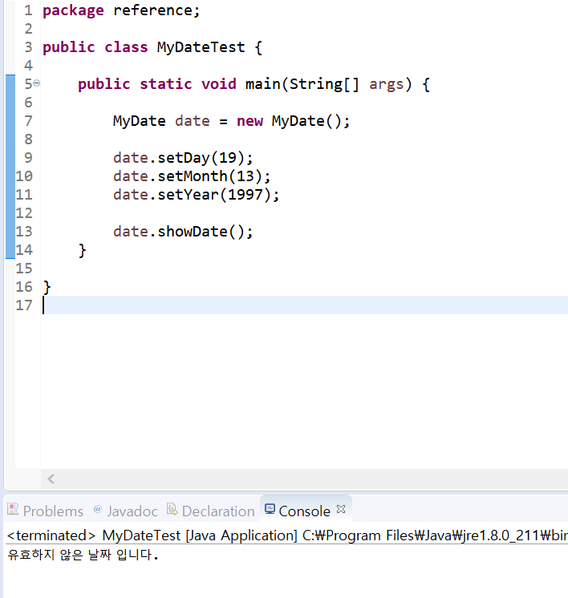

# 07. 정보 은닉 (information hiding)
    
#### 접근 제어자(access modifier)   
* 변수, 메소드, 생셩자에 대한 접근 권한 지정  
* public, private, protected, 아무것도 안 쓰는 경우(기본 접근 제어자)  
* private을 사용하면 클래스 외부에서는 접근 할 수 없음  
 
#### 정보 은닉 (information hiding)  
* 외부에서 클래스 내부의 정보에 접근하지 못하도록 함 -> private 키워드 활용  
* private 변수를 외부에서 접근하게 하려면 public 메소드를 제공함  
* 클래스 내부 데이터를 잘못 사용하는 오류를 방지할 수 있음(get/set)  

#### 실습해보기  
```
package reference;

public class MyDate {
	//int day => default 같은 패키지 안에서 이용 가능
	private int day;
	private int month;
	private int year;
	
	private boolean isValid;
	
	//Source -> Generate gettres and setters 에서 private 으로 지정해놓은 목록 나옴
	public int getDay() {
		return day;
	}
	
	public void setDay(int day) {
		this.day = day;
		//매개변수(지역변수)의 이름과 멤버변수(this)의 이름 동일하게 함 
	}
	
	public int getMonth() {
		return month;
	}

	public void setMonth(int month) {
		//오류의 방지
		if (month < 1 || month > 12) {
			isValid = false;
		}
		this.month = month;
	}

	public int getYear() {
		return year;
	}

	public void setYear(int year) {
		this.year = year;
	}
	
	//만일 get만 오픈하고 set 닫으면 read only

	
	public void showDate() {
		
		if (isValid) {
			System.out.println(year + "년 " + month + "월 " + year + "일 입니다.");
		}
		else {
			System.out.println("유효하지 않은 날짜 입니다.");
		}
		
	}
}
```  

