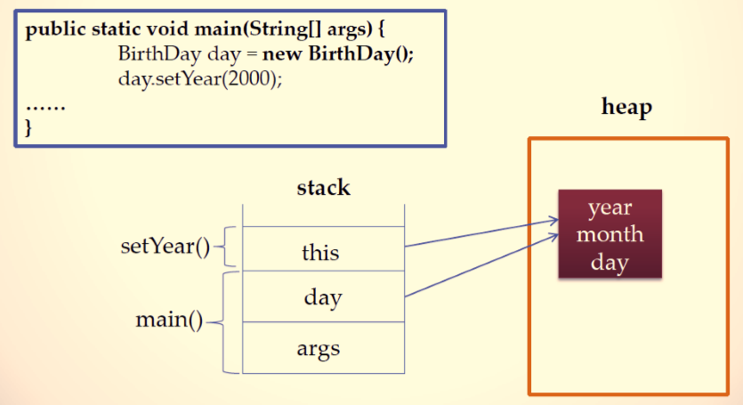
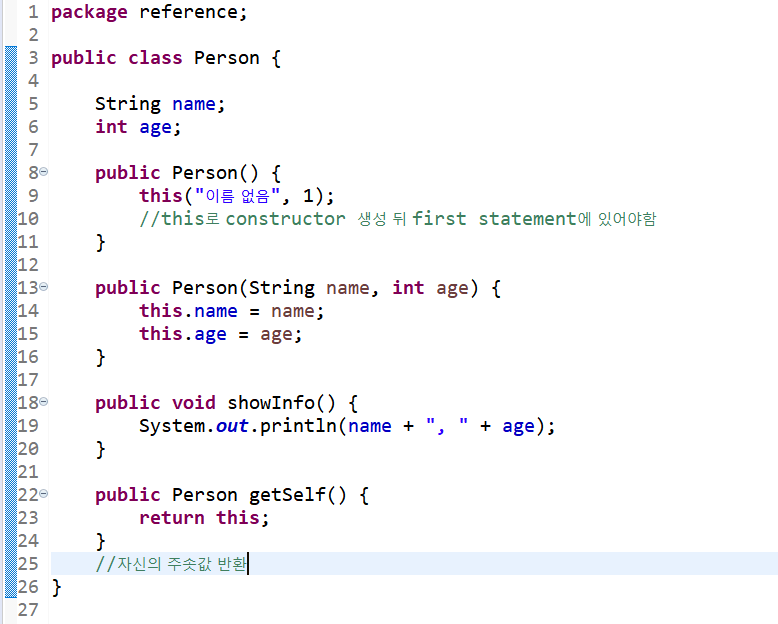
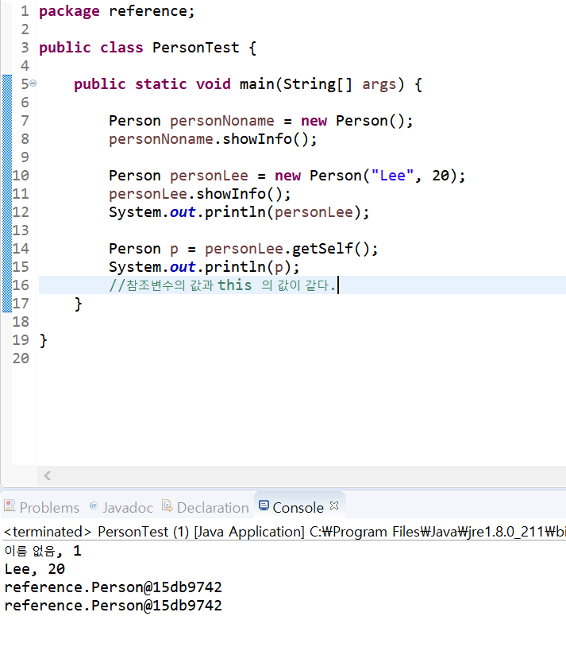

# 08. this에 대하여  
    
#### this의 역할  
* 자신의 메모리를 가리킴  
* 생성자에서 다른 생성자를 호출함  
* 인스턴스 자신의 주소를 반환  
 
#### 1. 자기 자신의 메모리를 가리키는 this  
  

#### 2. 생성자에서 다른 생성자를 호츨  
```
public Person() {
	this("이름 없음",1);
}
public Person(String name, int age) {
	this.name = name;
    this.age = age;
}
```  

#### 3. 자신의 주소를 반환하는 this
```
public Person getPerson() {
	return this;
}
```  

#### 실습해보기  
  
  
