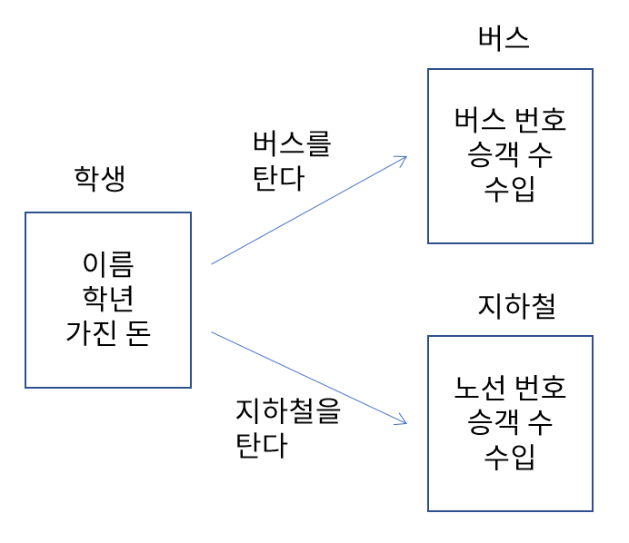
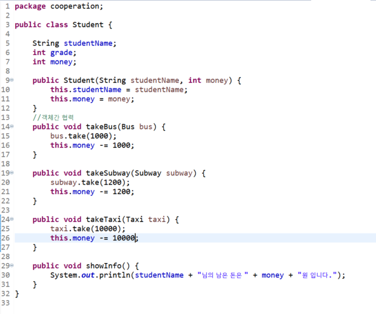
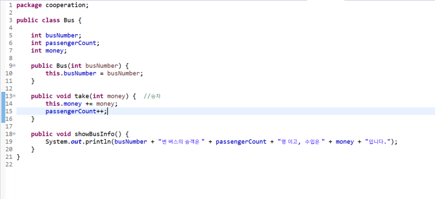
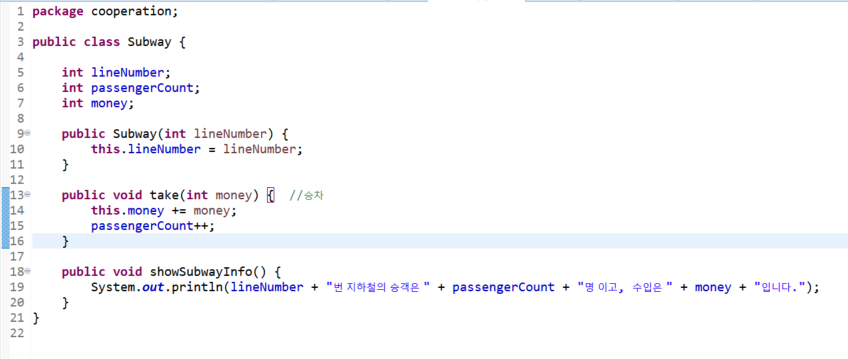
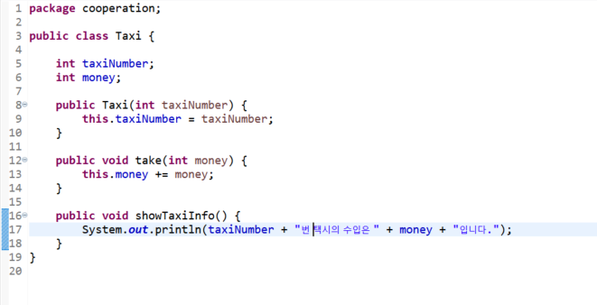
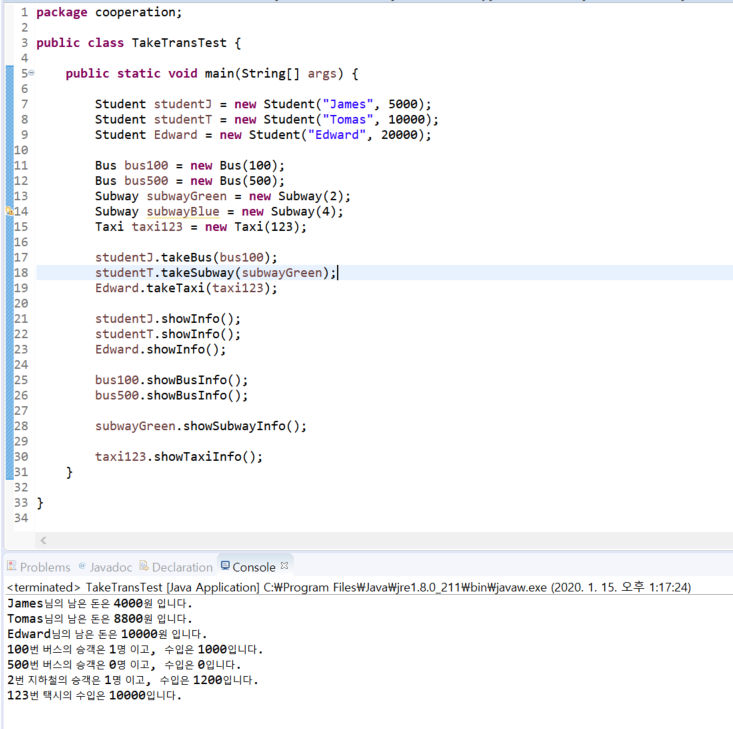

# 09. 객체 간 협력  
    
* 객체 지향 프로그램은 객체를 정의하고 객체간의 협력을 구현한 프로그램  
* 학생이 지하철이나 버슬르 타고 학교 가는 과정에서 일어나는 협력  
 

#### 실습해보기  
Edward는 늦게 일어나 학교에 지각을 했다. 택시를 타고 10000원을 지불하였다. 이 상황을 코드에 추가하시오
  
> takeBus/ takeSubway/ takeTaxi 의 매개변수인 객체와 참조변수 헷갈리지 말 것 !  
> 참조변수 = 메소드 없이 멤버변수만 선언된 것?(추후 추가하기)  
  
  
 
 
 
 
