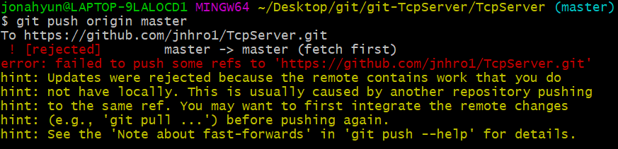

# git 시작하기
## 1. clone
git clone "레파지토리 주소"  

## 2. add
git add * / git add [파일이름]  
-확인 git status  

## 3. commit
git commit -m "커밋명령어"  

## 4. push
git push origin master  

### push 시 해당 오류 발생

발생 원인 : 원격에서 변경사항이 로컬에 적용이 안된 경우  
나의 경우 주로 원격 README.md 파일 변경  
해결 방안 : git pull origin master  
->원격의 저장 내용을 불러와 합친후 다시 push(git pull 명령어는 fetch 후 merge를 한다.)
