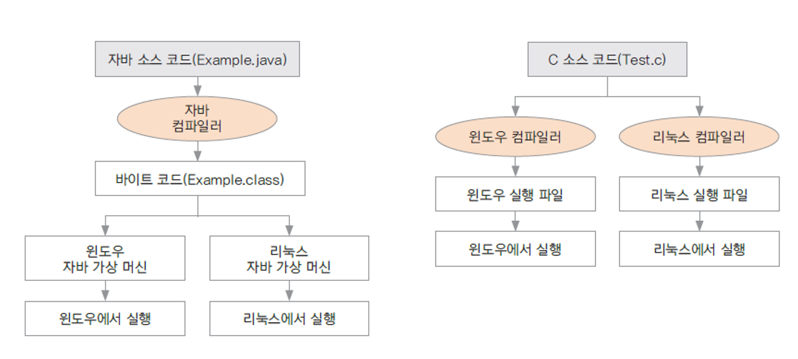

# 자바 프로그래밍 시작하기
1. 프로그래밍과 자바  
프로그래밍 이란?  
프로그래밍 : 컴퓨터에게 일을 시키기 위해 프로그래밍 언어로 만든 명령어 집합인 프로그램을 만드는 일  
컴파일 : 프로그래밍 언어를 기계어로 바꾸어 주는 일  
컴파일러 : 기계어로 바꾸어 주는 프로그램 / 자바를 설치하면 자바 컴파일러도 설치됨  

2. 다른 언어와의 차이점  
플랫폼에 독립적인 프로그래밍을 할 수 있음  
  

3. 자바 프로그램의 특징
>1. 객체지향 프로그램으로 유지 보수와 확장성이 좋다.  
>2. 안정적이다.  
>3. 풍부한 라이브러리가 제공되고 오픈소스와 연동된다.

4. 왜 객체지향프로그램을 해야하는가
>1. 재사용성
>2. 유지보수
>3. 코드관리
>4. 신뢰성 높은 프로그램

5. 자바로 만들 수 있는 프로그램들
>1. 웹서버
>2. 모바일 앱
>3. 게임

