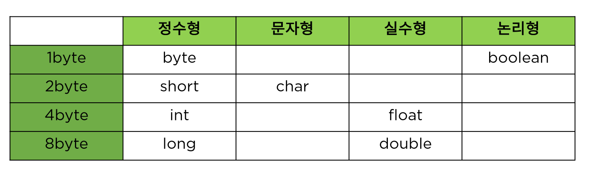
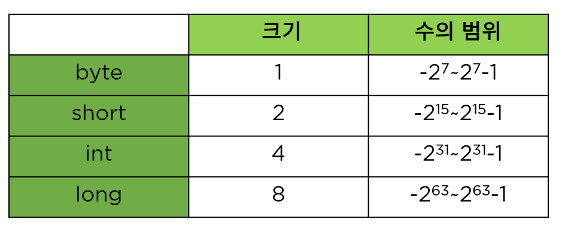

# 변수와 자료형
  
  
## 변수란 무엇인가?
1. 변수 : 변하는 수  
사람의 나이, 온라인 상품의 개수, 학생의 학년  
변하는 값을 프로그램에서 나타내기 위한 방법  
  
1-1 변수 선언하기  
자료형 변수 이름;  
<code>int age;</code>  
변수에 맞는 자료형과 변수 이름으로 선언  

1-2 변수와 메모리  
변수를 선언하는 것은 해당 자료형의 크기 만큼의 메모리를 사용하겠다는 것  
메모리의 위치를 변수 이름으로 참조  

1-3 변수 이름 규칙  
>1. 영문자나 숫자를 하용함. 단 숫자로 시작할 수 없음
>2. 특수문자 중에는 _ 와 $ 만 사용가능  
>3. 예약어는 사용할 수 없음  
>4. 변수는 그 쓰임에 맞는 이름으로 명명하는 것이 가독성에 좋음  
>5. camel notation : numberOfStrudent  
>6. 약어 사용은 권장하지 않음 길어도 다 쓰기!  

## 정수 자료형

기본형 : 자바 언어에서 기본적으로 제공해 주는 자료형  
메모리의 크기가 정해져 있음  
정수형, 문자형, 실수형, 논리형    
참조형 : 클래스 자료형  
JDK에서 제공되는 클래스와 프로그래머가 정의하는 클래스 
클래스에 따라 사용하는 크기가 다름  
ex)String,Student  

기본 자료형  
  

바이트 크기와 표현 범위   

  
## 문자 자료형
내부적으로 비트의 조합으로 표현  
인코딩 : 각 문자에 따른 특정한 숫자 값(코드 값)을 부여  
디코딩 : 숫자 값을 원래의 문자로 변환  
  
문자세트 : 문자를 위한 코드 값(숫자값)들을 정해 놓은 세트  
아스키 : 1바이트로 영문자, 숫자, 특수문자 등을 표현함  
유니코드 : 한글과 같은 복잡한 언어를 표현하기 위한 대표적인 언어 UTF-8이 대표적  
문자를 변수에 저장하면? 문자에 해당하는 코드 값이 저장됨  

## 실수와 논리 자료형
1. 실수  
double 자료형이 기본적  
float를 사용할 때는 f, F 실별자 사용  

부동소수점 방식 : 실수를 지수부와 가수부로 표현함 / 0.1 을 표현하는 방식  

###부동소수점 방식의 오류  

지수와 가수로 표현 되는 부동 소수 점은 0을 표현할 수 없음  
따라서 부동 소수점 방식에서는 약간의 오차가 발생할 수 있음  

2. 논리자료형
boolean 으로 설정 / true false  

3. 자료형 없이 변수 사용하기(자바10)  
지역 변수 자료형 추론  
변수에 대입되는 값을 보고 컴파일러가 추론  
var num = 10; -> int num = 10;  

## 상수와 리터럴

1. 상수 : 변하지 않는 수  
리터럴 : 프로그램에서 사용하는 모든 숫자, 값, 논리 값 ex)10, 3.14, 'A', true  
모든 리터럴은 상수 푸에 저장되어 있음  
상수 풀에 저장될 때 정수는 int, 실수는 double로 저장됨  
  
2. 형변환  
서로 다른 자료형의 값이 대입되는 경우 형 변환이 일어남  
묵시적 형 변환 : 작은 수에서 큰 수로/ 덜 정밀한 수에서 더 정밀한 수로 대입되는 경우  
명시적 형 변환 : 변환되는 자료형을 명시 / 자료의 손실이 발생 할 수 있음 / 타입캐스팅  
