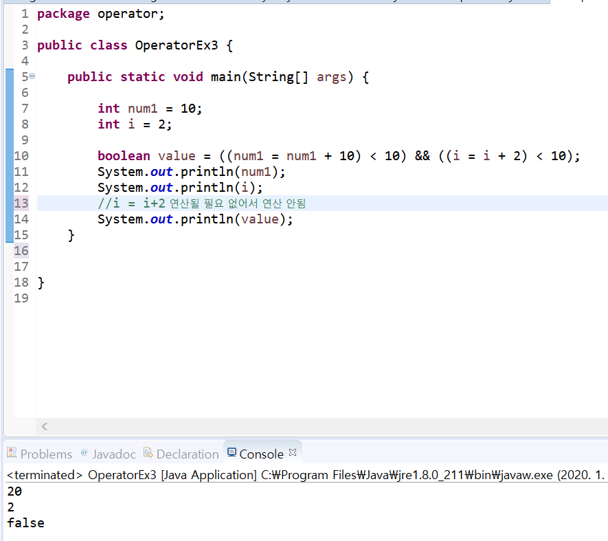

# 연산자
  
  
## 항과 연산자  
#### 항 (operand) : 연산에 사용되는 값  
#### 연산자 (operator) : 항을 이용하여 연산하는 기호  
#### 항의 개수와 연산자
  

## 대입 연산자 
#### int age(Lvalue) = 20; (Rvalue)  
#### 왼쪽 변수의 값이 오른쪽에 대입  
#### 우선 순위가 가장 낮은 연산자

## 부호 연산자
#### 단항 연산자
#### 변수의 부호를 유지하거나(+) 바꿈(-)
#### 실제 변수의 값이 변하려면 대입연산자를 사용해야 함

## 산술 연산자
#### 사칙연산 연산자  
  
#### %는 나머지를 구하는 연산자
숫자 n의 나머지 범위는 0 ~ n-1  

## 복합 대입 연산자
#### 대입연산자와 다른 연산자가 함께 쓰임
  
  

## 증가, 감소 연산자  
#### 단항 연산자
#### 변수의 값을 1 더하거나 뺄 때 사용
#### 연산자가 항의 앞에 있는가 뒤에 있는가에 따라 그 결과가 달라짐  
  
  
## 관계 연산자
#### 연산의 결과가 true/flase 로 반환됨
#### 비교 연산자 라고도 함
  

## 논리 연산자
#### 관계 연산자와 함께 많이 사용됨
#### 연산의 결과가 true/false로 반환 됨
  

## 단락 회로 평가 (short circuit evaluation)
#### 논리곱(&&)은 두 항이 모두 true 일 때만 결과가 true  
> 앞의 항이 false 이면 뒤 항의 결과를 평가하지 않아도 false 임  
#### 논리합(||)은 두 항이 모두 false 일 대에만 결과가 false  
> 앞의 항이 true 이면 뒤 항의 결과를 평가하지 않아도 true 임  
!! 실제 프로그램에서 예상하지 않는 결과가 발생할 수 있으므로 유의
  
  

## 조건 연산자
#### 조건식? 결과 1 : 결과 2;
#### int num = (5>3)? 10 : 20;  
#### 간단한 조건문 대신 사용할 수 있는 연산자

## 비트 연산자
#### 실제로 잘 쓰지는 않지만 속도가 굉장히 빠름  
#### 2의 거듭수를 곱하거나 나눌 때 사용
  
  
## 연산자 우선 순위
  
