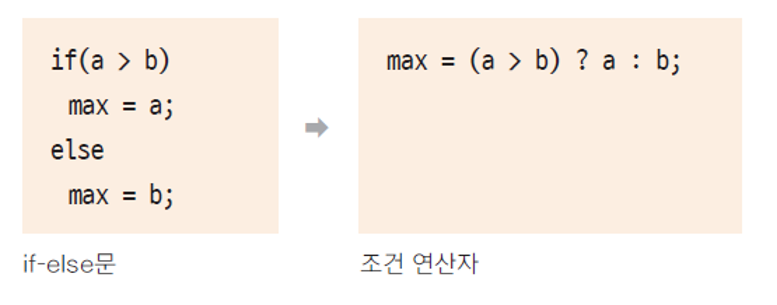
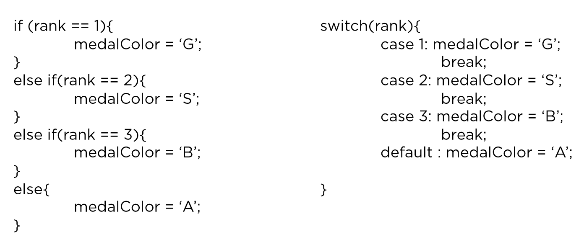
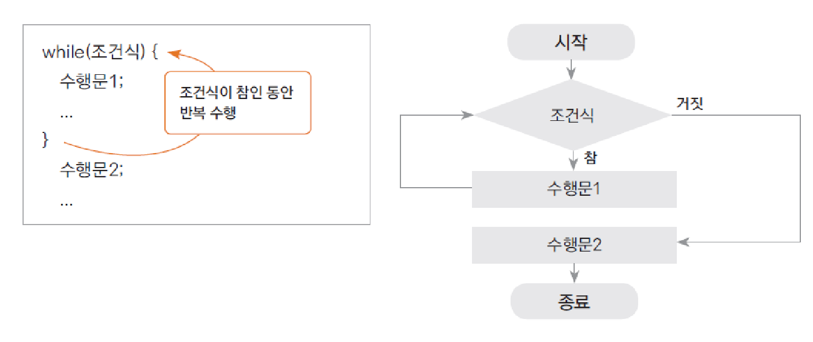
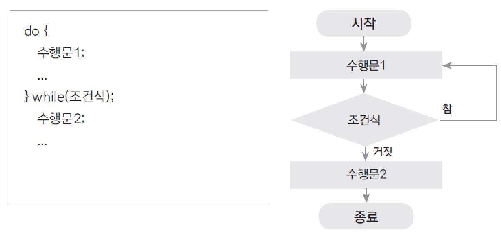

# 제어문
  
  
## if 문 
* 조건식의 결과에 따라 수행문이 실행되는 조건문
<code>
  if (조건식) {  
	수행문;  
}
  </code>  
  
#### if-else 문
if (조건식) {  
	수행문1;  
} else {  
	수행문2;  
}
  </code>  
* state가 한줄 일때 {} 사용하지 않지만 습관적으로 권장함!  
* block 시작 시 들여 쓰기!  

#### if-else if-else 문
* 하나의 조건에 대한 여러 경우에 대해 수행문이 각각 다른 경우  
<code>
  if (조건식1) {  
	수행문1;  
} else if (조건식2){   
	수행문2;  
} else if (조건식3){  
	수행문3;  
} else {  
	수행문4;  
}  
}
  </code> 
   
#### if-else 문은 조건 연산자로 구현 할 수 있음
   
 
## switch-case 문
* 조건이 정수, 문자열 값으로 그 값에 따라 수행 결과가 달라지는 경우  
* if-else if-else 와 같은 의미로 수행  
* 자바7부터 조건에 문자열 사용 가능
   

## 반복문
* 동일한 수행문을 조건에 맞는 동안 수행하도록 하는 기능
* 달리는 자동차
* 일정 횟수만큼 돌아가는 나사
* 특정 온도까지 가동되는 에어컨  

## while 문
* 조건이 참인 동안 수행문이 반복해서 수행됨
  

## do-while 문
* 먼저 수행문을 수행하고 조건 체크
* 한번 이상 수행문이 수행되어야 하는 경우 사용
  

## for 문
* 반복문 중 가장 많이 사용됨  
* 일정 횟수에 기반한 반복을 구현할 때 효율적임  
  
 
#### 각 반복문의 쓰임
  
  
## 중첩 반복문
* 반복문이 중첩되어 구현되는 경우
* 반복문 내부에 또 다른 반복문이 있음
* 외부 반복문과 내부 반복문 간의 변수 값 변화에 유의 하며 구현해야 함

## break 문
* 감싸고 있는 블록의 제어를 빠져나오는 기능
* 반복문, 조건문, switch-case 등과 같이 쓰이며 현재 수행하고 있던 블록에서 수행을 중지하고 외부로 제어가 이동함
* 반복문과 같이 사용하면 특정 조건일 때 반복을 중지 하는 기능을 구현할 수 있음
* 속해있는 한 블록만 빠져 나옴

## continue 문
* 반복의 수행 중 조건문과 조건이 맞는 경우  이후 블록 내부의 다른 수행문을 수행하지 않음

